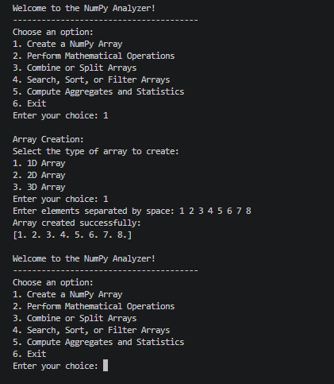
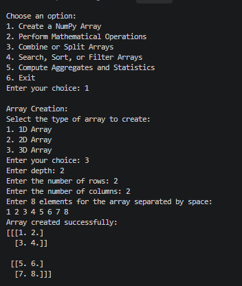
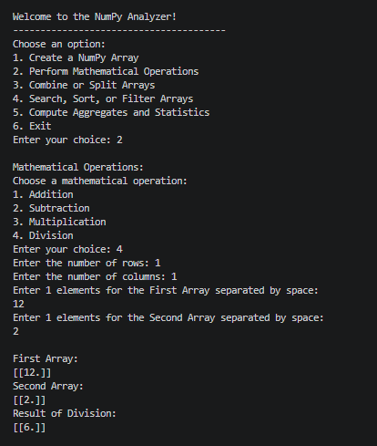
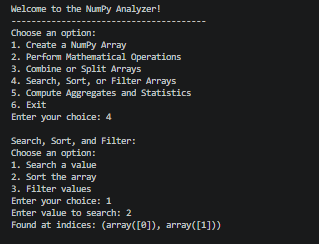
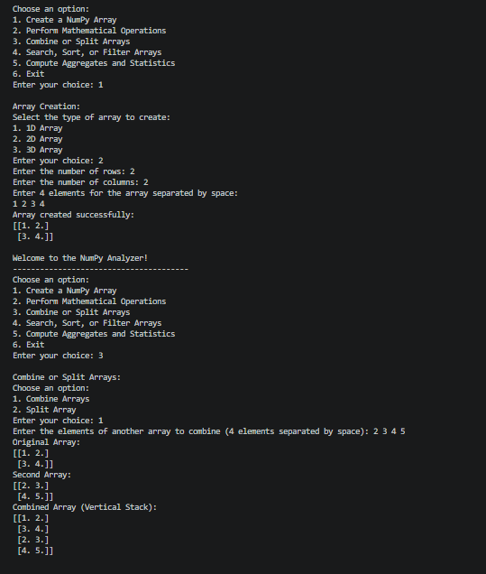
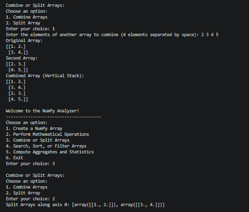
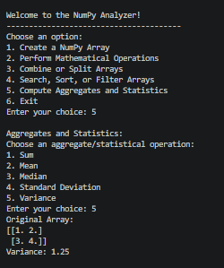

# NumPy Analyzer

A robust and interactive command-line Python application built using **NumPy** to perform array creation, mathematical operations, array manipulation (combining and splitting), searching, sorting, filtering, and statistical aggregations. 

Designed with an Object-Oriented Programming (OOP) approach, this tool serves as a comprehensive utility for data analysis and learning foundational NumPy operations.

---

## Features

1. **Array Creation**
   - Create **1D**, **2D**, and **3D** arrays dynamically with custom shapes, dimensions, and user-provided inputs.
2. **Mathematical Operations**
   - Perform element-wise arithmetic operations on arrays:
     - Addition (`np.add`)
     - Subtraction (`np.subtract`)
     - Multiplication (`np.multiply`)
     - Division (`np.divide`)
3. **Combine or Split Arrays**
   - Stack and combine multiple arrays vertically or split arrays along axes using NumPy splitting utilities.
4. **Search, Sort, and Filter Arrays**
   - **Search:** Locate specific values and return their exact index locations (`np.where`).
   - **Sort:** Sort array elements in ascending/descending order.
   - **Filter:** Extract elements meeting specific conditional criteria (e.g., values greater than a threshold).
5. **Aggregates and Statistics**
   - Compute key statistical metrics instantly:
     - Sum (`np.sum`)
     - Mean (`np.mean`)
     - Median (`np.median`)
     - Standard Deviation (`np.std`)
     - Variance (`np.var`)

---

## Project Structure & Architecture

The project follows an Object-Oriented paradigm encapsulating state and behavior within the `DataAnalytics` class:

- **Private Encapsulation:** Array states are managed via private instance variables (`self.__array`).
- **Class Methods & Static Methods:** Includes class-level metadata and validation helpers.
- **Interactive CLI Loop:** Continuous menu-driven workflow with robust input handling.

---

## Application Walkthrough & Screenshots

### 1. Main Menu Interface

### 2. Array Creation (1D, 2D, and 3D Arrays)
- **1D Array Creation:**
  

- **2D Array Creation:**
  ![2D Array]Screenshots/(arraycreate_2d.png)

- **3D Array Creation:**
  

### 3. Mathematical Operations
- **Addition:**
  ![Addition]Screenshots/(arry_add.png)

- **Subtraction:**
  ![Subtraction]Screenshots/(arry_subtract.png)

- **Multiplication:**
  ![Multiplication]Screenshots/(arry_multiply.png)

- **Division:**
  

### 4. Search, Sort, and Filter Arrays
- **Search Value:**
  

  ### 4. Search, Sort, and Filter Arrays
- **Search Value:**
  

  ### 4. Search, Sort, and Filter Arrays
- **Search Value:**
  

  ### 5. Combine and Split Arrays
- **Combine Arrays:**
  
- **Split Array:**
  

### 6. Aggregates and Statistics
- **Sum & Mean:**
  
- **Median & Standard Deviation:**
  
- **Variance:**
  