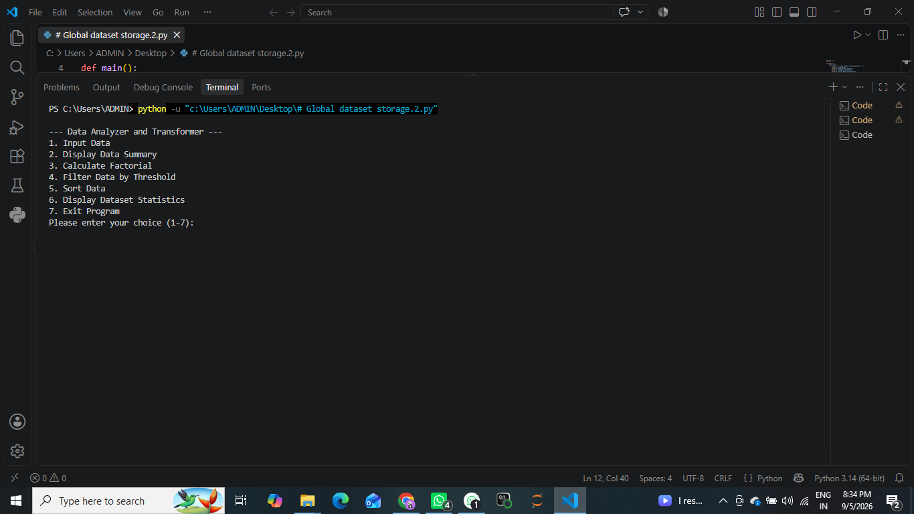
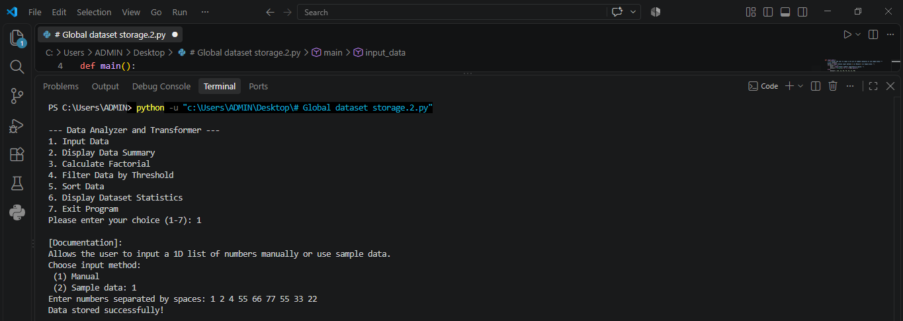
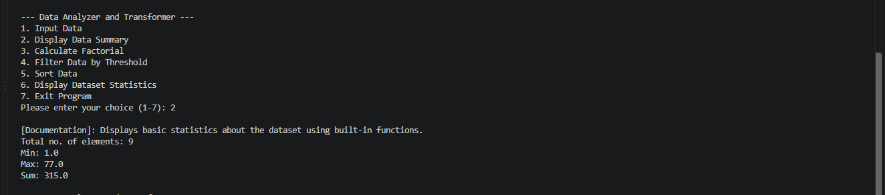
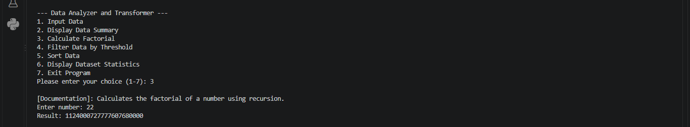
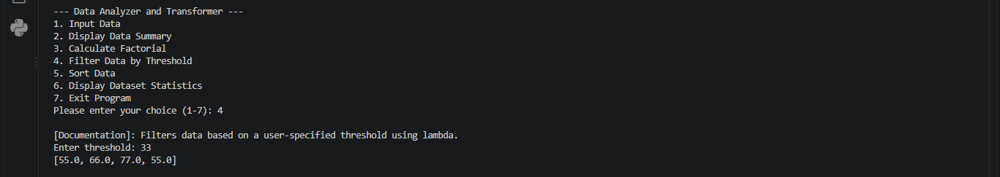
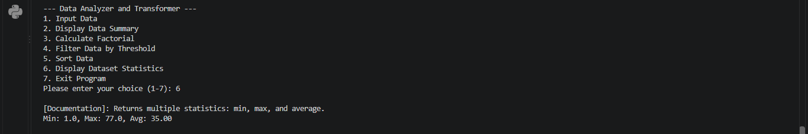

# Data Analyzer and Transformer

A lightweight, interactive Python command-line application designed for dataset manipulation, statistical analysis, mathematical computations, and data filtering.

---

## 📌 Features

- **Interactive Menu-Driven Interface**: Easily input, transform, and analyze datasets through a user-friendly CLI loop.
- **Data Input & Management**: Support for manual entry of numerical lists or instant pre-loaded sample datasets.
- **Statistical Summaries**: Quick computation of total element count, minimum, maximum, sum, and average.
- **Advanced Filtering**: Filter dataset elements dynamically using lambda expressions based on user-defined thresholds.
- **Sorting & Ordering**: Demonstrate in-place sorting and functional sorted outputs.
- **Recursive Mathematics**: Built-in recursive utility for calculating factorials.

---

## 📁 Project Structure

```text
├── main.py             # Main application script
└── README.md           # Project documentation
```

---

## 🚀 Getting Started

### Prerequisites
Make sure you have **Python 3.6 or higher** installed on your system. No external libraries or dependencies are required as the application uses standard Python built-in libraries.

### Running the Application

Execute the script from your terminal:

```bash
python main.py
```

---

## 🎮 Interactive Menu Options

When you run the program, you will be greeted with the following menu:

```text
--- Data Analyzer and Transformer ---
1. Input Data
2. Display Data Summary
3. Calculate Factorial
4. Filter Data by Threshold
5. Sort Data
6. Display Dataset Statistics
7. Exit Program
```

### Function Descriptions:
1. **Input Data**: Choose between entering custom space-separated numbers or loading default sample data (`[34, 12, 56, 78, 43, 21, 90]`).
2. **Display Data Summary**: Outputs basic summary metrics (`len`, `min`, `max`, `sum`).
3. **Calculate Factorial**: Computes the factorial of any user-provided integer recursively.
4. **Filter Data by Threshold**: Displays elements greater than a specified numeric threshold using `lambda` filtering.
5. **Sort Data**: Returns sorted representations of the current dataset.
6. **Display Dataset Statistics**: Computes and displays structured statistics including min, max, and formatted average.

---

## 🖼️ Application Screenshots

### 1. Main Menu & Startup


### 2. Data Input Workflow


### 3. Data Summary


### 4. Recursive Factorial Calculation


### 5. Lambda Threshold Filtering


### 6. Dataset Statistics Display


---

## 📄 License
This project is open-source and available for educational and personal use.