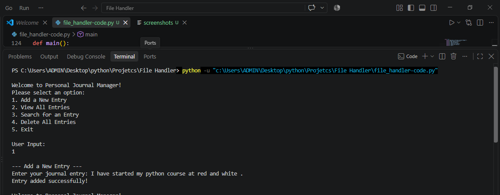
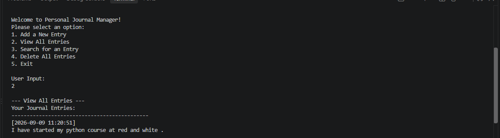
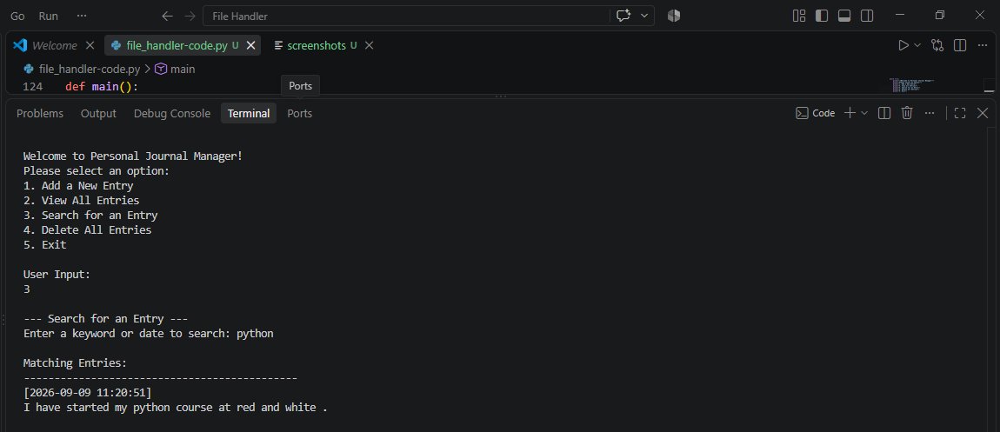
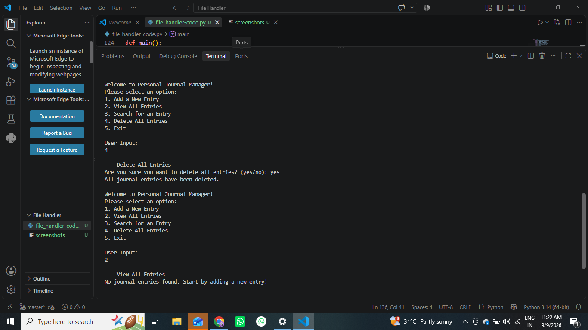
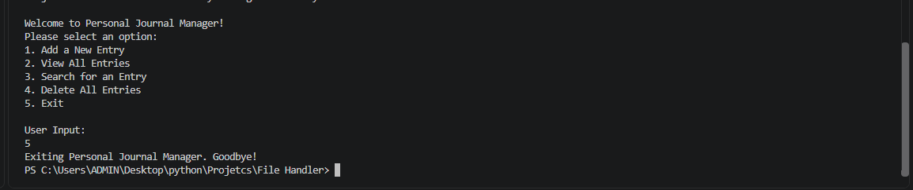

# Personal Journal Manager - File Operator 

## Project Overview
The **Personal Journal Manager** is a console-based application built in Python that allows users to create, view, search, and manage personal journal entries using file handling and object-oriented programming (OOP) principles. 

---

## Features & OOP Structure
- **Object-Oriented Design:** Encapsulated inside a `JournalManager` class handling all file operations and exception management.
- **File Handling Modes:** 
  - **`a` (Append):** Used for creating and appending new timestamped entries to `journal.txt`.
  - **`r` (Read):** Used for retrieving and reading all entries or searching by keywords/dates.
  - **`x` / `os.remove()`:** Utilized for file removal and safe cleanup.
- **Robust Exception Handling:** Gracefully handles `FileNotFoundError`, `PermissionError`, and unexpected errors without crashing.

---

## Console Interaction & Screenshots (Arranged by Menu Options)

### 1. Add a New Entry (Option 1)
Allows users to input journal notes, automatically appending a precise timestamp.


### 2. View All Entries (Option 2)
Displays all stored journal entries or notifies the user if the file is empty or missing.


### 3. Search for an Entry (Option 3)
Allows users to search through entries by keyword or date.


### 4. Delete All Entries (Option 4)
Prompts for confirmation before clearing/deleting the journal file.


### 5. Exit (Option 5)
Safely exits the console application loop.


---

## How to Run the Project
1. Ensure Python 3.x is installed.
2. Save the code as `journal_manager.py`.
3. Open your terminal or VS Code and run:
   ```bash
   python journal_manager.py
   ```
4. Follow the on-screen menu prompts.