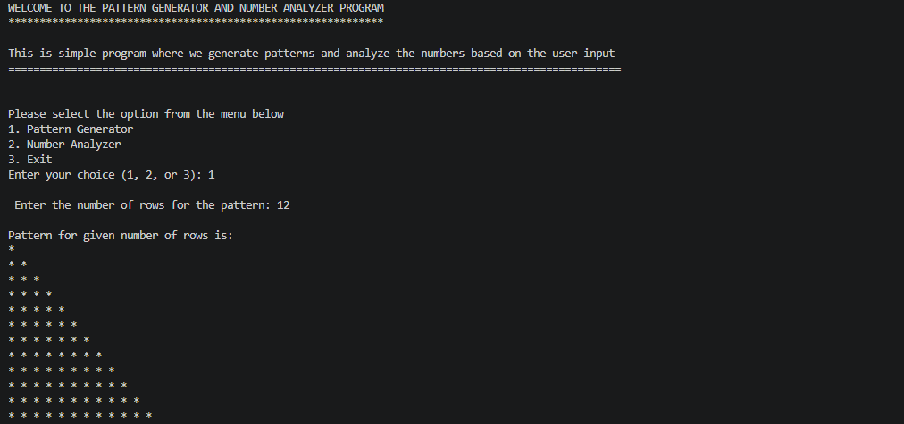
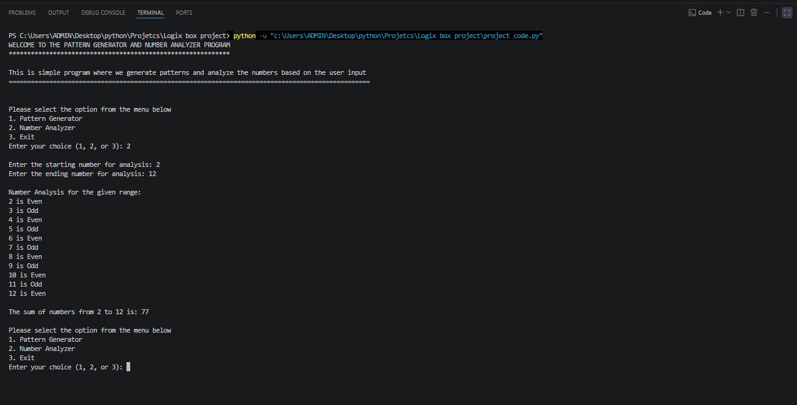
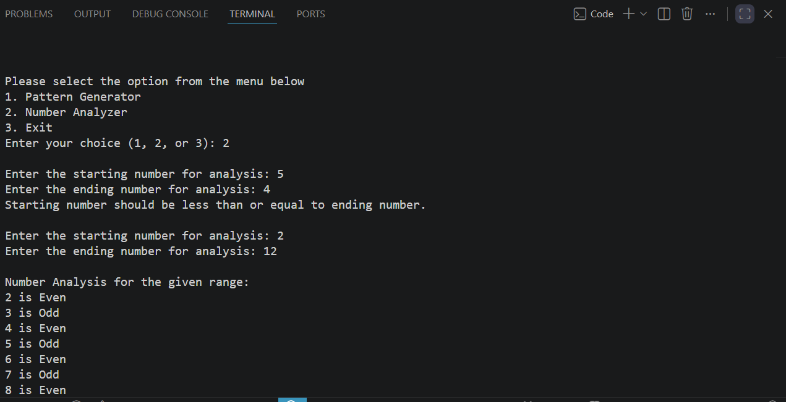

# Pattern Generator and Number Analyzer

A simple Python console application that allows users to generate patterns and analyze numbers based on user input.

---

## Features

### Pattern Generator
- Generates a right-angled star pattern.
- Accepts the number of rows from the user.
- Validates that the entered number is greater than zero.

### Number Analyzer
- Determines whether each number in a given range is Even or Odd.
- Calculates the sum of all numbers within the range.
- Handles invalid ranges by prompting the user to enter valid inputs again.

---

## Program Menu

```text
1. Pattern Generator
2. Number Analyzer
3. Exit
```

---

## Screenshot: Pattern Generator



---

## Screenshot: Number Analyzer



---

## Screenshot: Input Validation

This demonstrates validation when the starting number is greater than the ending number.



---

## Sample Output

### Pattern Generator

Input:

```text
Rows = 5
```

Output:

```text
*
* *
* * *
* * * *
* * * * *
```

### Number Analyzer

Input:

```text
Start = 2
End = 12
```

Output:

```text
2 is Even
3 is Odd
4 is Even
5 is Odd
6 is Even
7 is Odd
8 is Even
9 is Odd
10 is Even
11 is Odd
12 is Even

The sum of numbers from 2 to 12 is: 77
```

---

## Technologies Used

- Python 3
- Loops (`for`, `while`)
- Conditional Statements (`if`, `elif`, `else`)
- User Input
- Arithmetic Operations

---

## How to Run

Clone the repository:

```bash
git clone https://github.com/your-username/your-repository-name.git
```

Navigate to the project directory:

```bash
cd your-repository-name
```

Run the program:

```bash
python project_code.py
```

---

## Learning Outcomes

This project demonstrates:

- Menu-driven programming
- Nested loops
- Input validation
- Pattern generation
- Number analysis
- Sum calculation
- Python fundamentals

---

## Author

**Jyoti Sharma**

Python Mini Project – Pattern Generator and Number Analyzer