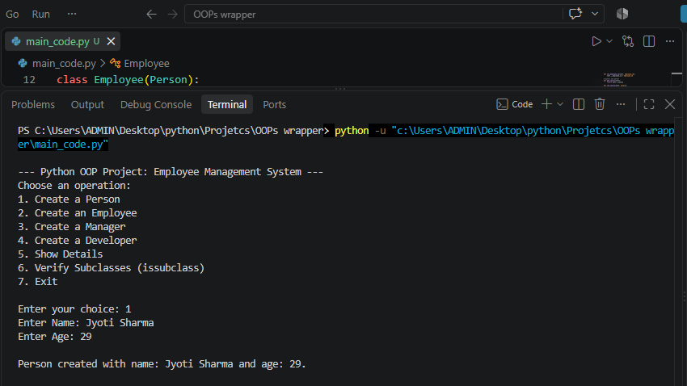
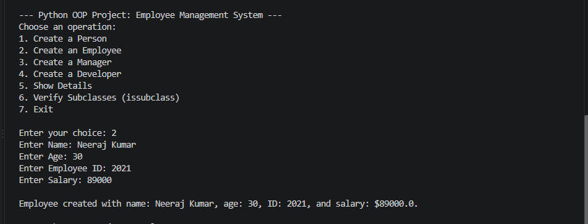
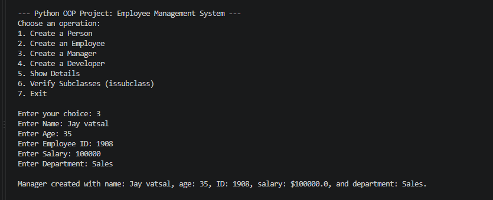
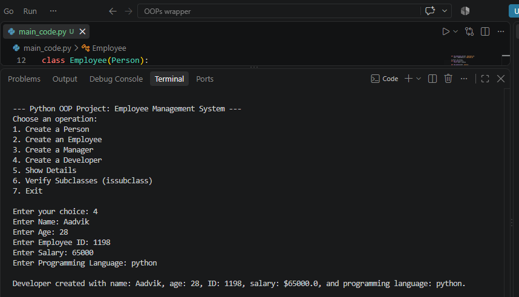
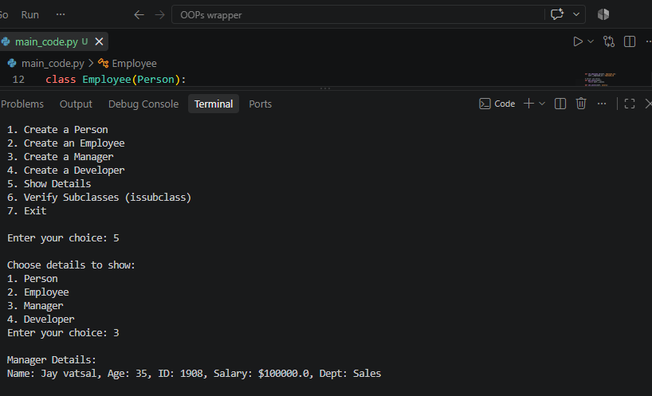
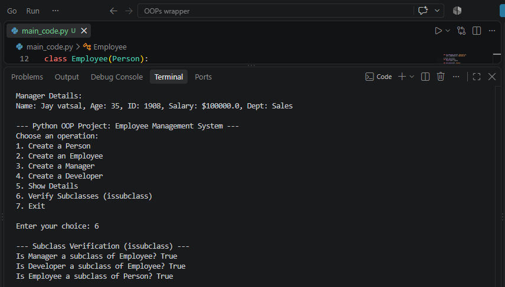

# Employee Management System - Python OOP Project 

## Project Overview
The goal of this project is to build an **Employee Management System** that utilizes various Object-Oriented Programming (OOP) concepts such as classes, inheritance, encapsulation, method overloading, method overriding, and more. The system models employee data and operations related to adding, updating, and tracking roles (e.g., Manager, Developer).

---

## Features & OOP Concepts Implemented

1. **Classes & Inheritance:**
   - `Person`: Base class containing general attributes (`name`, `age`) and a `display()` method.
   - `Employee`: Derived class from `Person` with private attributes for `employee_id` and `salary`.
   - `Manager`: Derived class from `Employee` adding a `department` attribute and overriding the `display()` method.
   - `Developer`: Derived class from `Employee` adding a `programming_language` attribute and overriding the `display()` method.

2. **Encapsulation:**
   - Sensitive data like `__employee_id` and `__salary` are kept private with getter and setter methods provided.

3. **Method Overloading & Overriding:**
   - **Method Overloading:** Simulated via default parameters in constructors to allow flexible object creation.
   - **Method Overriding:** The `display()` method is overridden across subclasses to include specific details (like department or programming language).

4. **Advanced Built-ins (`super()` and `issubclass()`):**
   - Utilizes `super()` to inherit and invoke parent class constructors/methods.
   - Utilizes `issubclass()` to verify class hierarchies dynamically.

5. **Destructors:**
   - Implemented `__del__` destructors for resource clean-up tracking.

6. **Menu-Driven User Interface (UI):**
   - An interactive console interface allowing users to create records, view detailed listings, verify subclass relationships, and exit safely.

---

## Console Interaction Samples

Here are examples of the program running through its different options:

### 1. Creating a Person (`Jyoti Sharma`)


### 2. Creating an Employee (`Neeraj Kumar`)


### 3. Creating a Manager (`Jay vatsal`)


### 4. Creating a Developer (`Aadvik`)


### 5. Viewing Details (`Manager Details`)



---

## Recommended IDLE / Environment
- **VS Code (Visual Studio Code)** or **PyCharm** is highly recommended for running and managing multi-file/script Python applications.
- Alternatively, you can use the standard Python **IDLE Shell** bundled with Python installations.

---

## How to Run the Project

1. Ensure Python 3.x is installed on your system.
2. Download or save the script as `main_code.py`.
3. Open your terminal, command prompt, or preferred IDLE.
4. Execute the script using the command:
   ```bash
   python main_code.py
   ```
5. Follow the on-screen menu prompts to create and manage records.

---

## Project Structure
- `main_code.py`: Main source code containing all OOP classes and the console application loop.
- `README.md`: Documentation file detailing the project architecture and instructions.