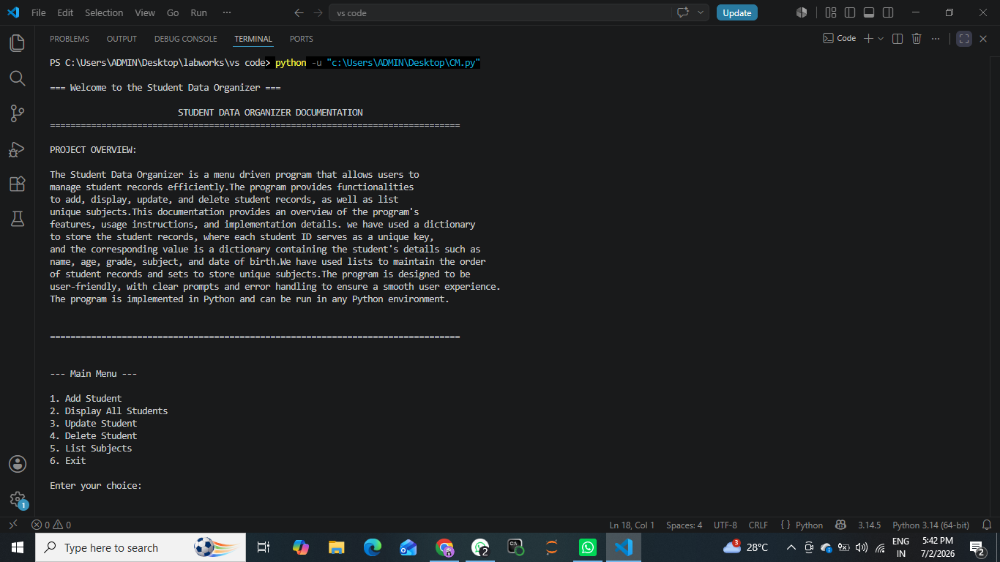
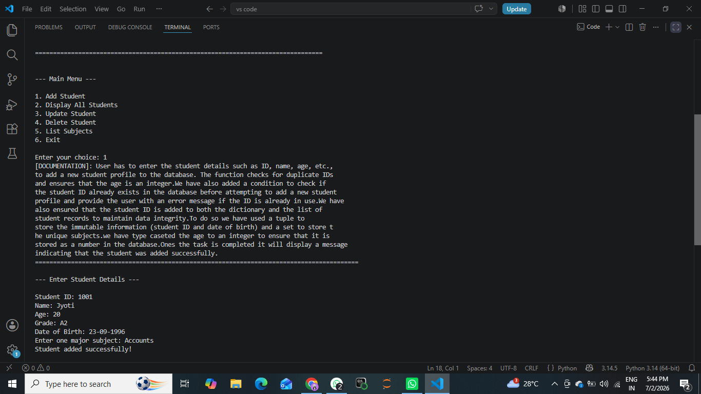
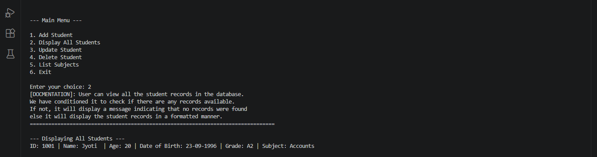
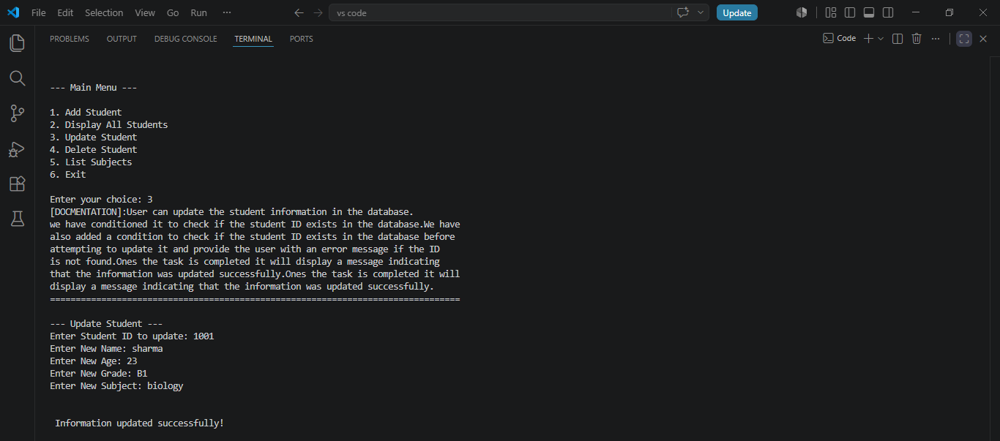
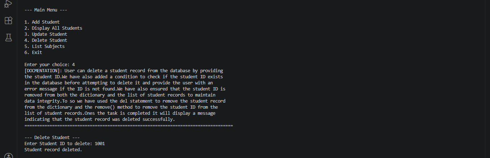
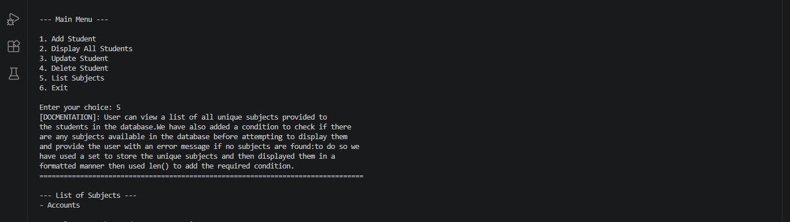
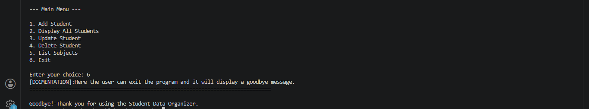

# 🎓 Student Data Organizer

A simple **menu-driven Python application** for managing student records. This project demonstrates the use of Python data structures such as **dictionaries, lists, sets, tuples**, along with **conditional statements, loops, functions, and pattern matching** to perform CRUD (Create, Read, Update, Delete) operations.

---

## 📌 Features

- ➕ Add Student Records
- 📋 Display All Students
- ✏️ Update Existing Student Details
- ❌ Delete Student Records
- 📚 Display List of Unique Subjects
- 🚪 Exit the Program
- ✅ Duplicate Student ID Validation
- ✅ Error Handling for Invalid Operations

---

## 🛠 Technologies Used

- Python 3.x
- VS Code

---

## 📂 Data Structures Used

| Data Structure | Purpose |
|---------------|---------|
| Dictionary | Stores student records using Student ID as the key |
| List | Maintains the order of student records |
| Set | Stores unique subjects |
| Tuple | Stores immutable information (Student ID and Date of Birth) |

---

## 📋 Project Overview

The Student Data Organizer is a console-based application that allows users to manage student information efficiently.

Each student record contains:

- Student ID
- Name
- Age
- Grade
- Date of Birth
- Subject

The application provides a user-friendly menu interface to perform different operations while maintaining data integrity.

---

## ▶️ How to Run

1. Clone this repository

```bash
git clone https://github.com/your-username/student-data-organizer.git
```

2. Navigate to the project folder

```bash
cd student-data-organizer
```

3. Run the program

```bash
python CM.py
```

---

# 📖 Menu Options

```
1. Add Student
2. Display All Students
3. Update Student
4. Delete Student
5. List Subjects
6. Exit
```

---

# 📸 Program Screenshots

## Welcome Screen




---

## Add Student



---

## Display Students



---

## Update Student



---

## Delete Student



---

## List Subjects



---

## Exit Program



---

## 🧠 Concepts Demonstrated

- Dictionaries
- Lists
- Sets
- Tuples
- Functions
- Loops
- Conditional Statements
- Match-Case Statements
- User Input
- Error Handling
- CRUD Operations

---

## 📁 Project Structure

```
Student-Data-Organizer/
│
├── CM.py
├── README.md
├── Screenshot (122)(1).png
├── Screenshot (123)(1).png
├── Screenshot (124)(1).png
├── Screenshot (125)(1).png
├── Screenshot (126)(1).png
├── Screenshot (127)(1).png
└── Screenshot (128)(1).png
```

---


## 👩‍💻 Author

**Jyoti Sharma**

Python Mini Project

---

## ⭐ If you found this project useful, don't forget to give it a star!