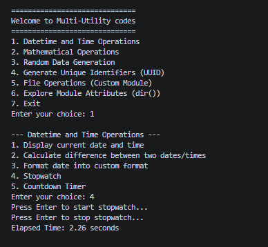
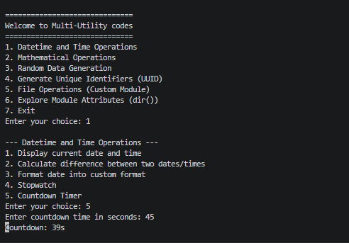
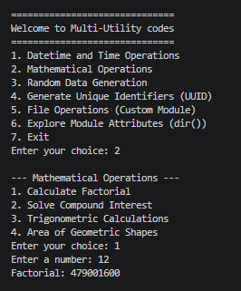
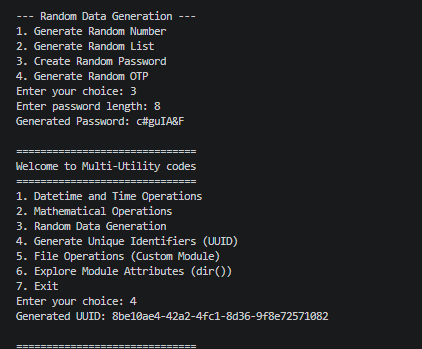
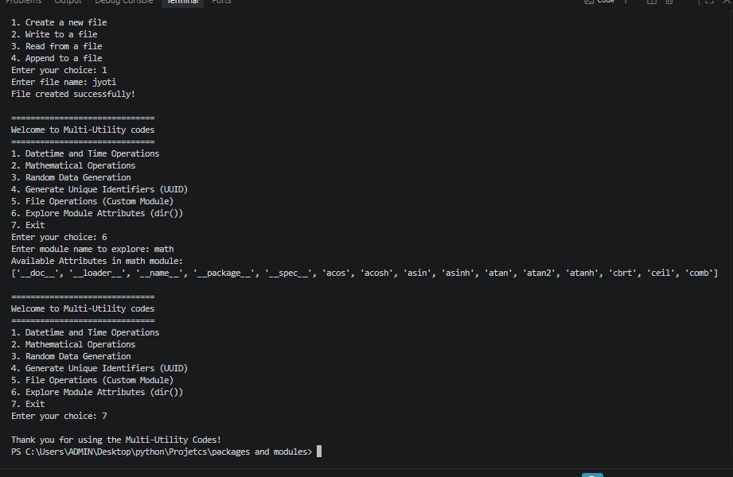

# Multi-Utility Python Project

A comprehensive, menu-driven command-line multi-utility application built using Python. This project demonstrates modular programming, package organization, custom modules, and practical utilization of standard and built-in Python libraries.

---

## Project Directory Structure

```text
MultiUtilityProject/
│
├── multi_utility_toolkit/          # Custom Package
│   ├── __init__.py                 # Package Initialization
│   ├── datetime_ops.py             # Date and Time Operations
│   ├── math_ops.py                 # Mathematical & Trigonometric Operations
│   ├── random_ops.py               # Random Data & Password Generation
│   ├── uuid_ops.py                 # Unique Identifier Generation
│   ├── file_ops.py                 # File Handling (Custom Module)
│   └── explore_ops.py              # Module Attribute Explorer (dir())
│
└── main.py                         # Main Execution Entry Point
```

---

## Features & Application Screenshots

### 1. Datetime and Time Operations
* **Current Date & Time:** Displays the exact system date and timestamp.
  * 
* **Date Difference:** Calculates the exact number of days between two given dates.
  * 
* **Stopwatch:** Measures elapsed time interactively by pressing Enter to start and stop.
  * 
* **Countdown Timer:** Counts down from a user-specified number of seconds.
  * 

### 2. Mathematical Operations
* **Factorial Calculation:** Computes the factorial for valid integers.
  * 
* **Compound Interest:** Solves financial interest formulas based on principal, rate, and time.
  * 
* **Trigonometric Calculations:** Evaluates standard trigonometric ratios (sin, cos, tan) for given degree angles.
  * 
* **Area of Geometric Shapes:** Calculates precise areas for shapes like circles and rectangles.
  * 

### 3. Random Data & Unique Identifiers (UUID)
* **Random Data Generation:** Generates random numbers, lists, secure passwords, and One-Time Passwords (OTPs).
* **UUID Generation:** Generates universally unique identifiers (UUID version 4) for tracking and identification.
  * 

### 4. File Operations & Module Explorer
* **File Operations:** Handles custom file interactions including creating, writing, reading, and appending text files.
* **Module Attribute Explorer (dir()):** Inspects and lists available methods, attributes, and constants of any built-in or custom Python module dynamically.
  * 

---

## How to Run the Project

1. Ensure Python is installed on your system.
2. Open your terminal or command prompt inside the root folder `MultiUtilityProject/`.
3. Execute the application using the following command:

```bash
python main.py
```