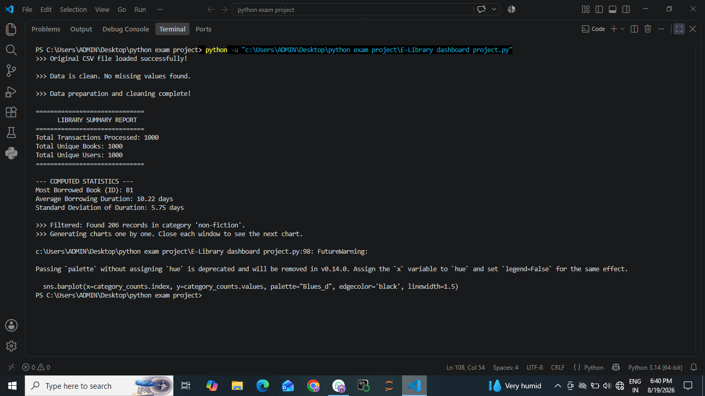
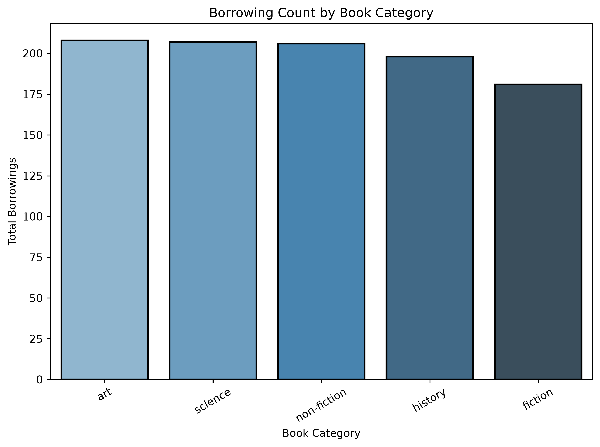
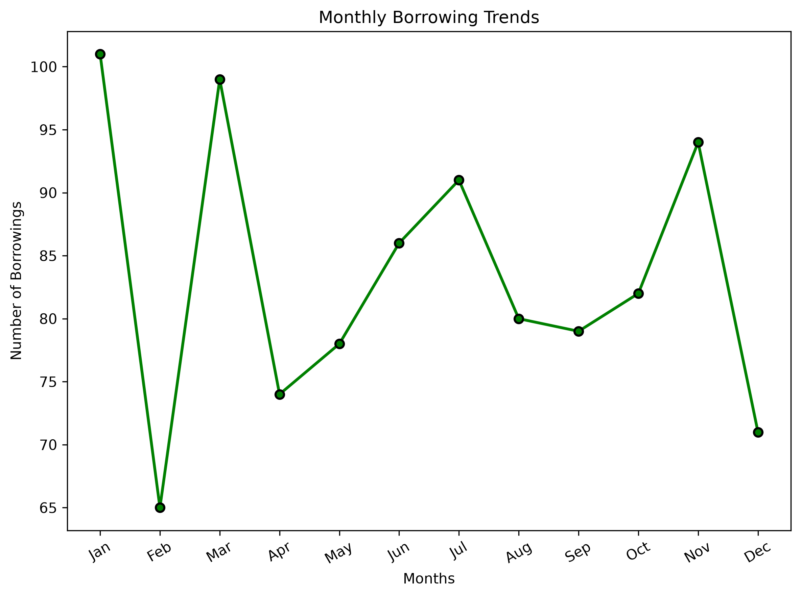
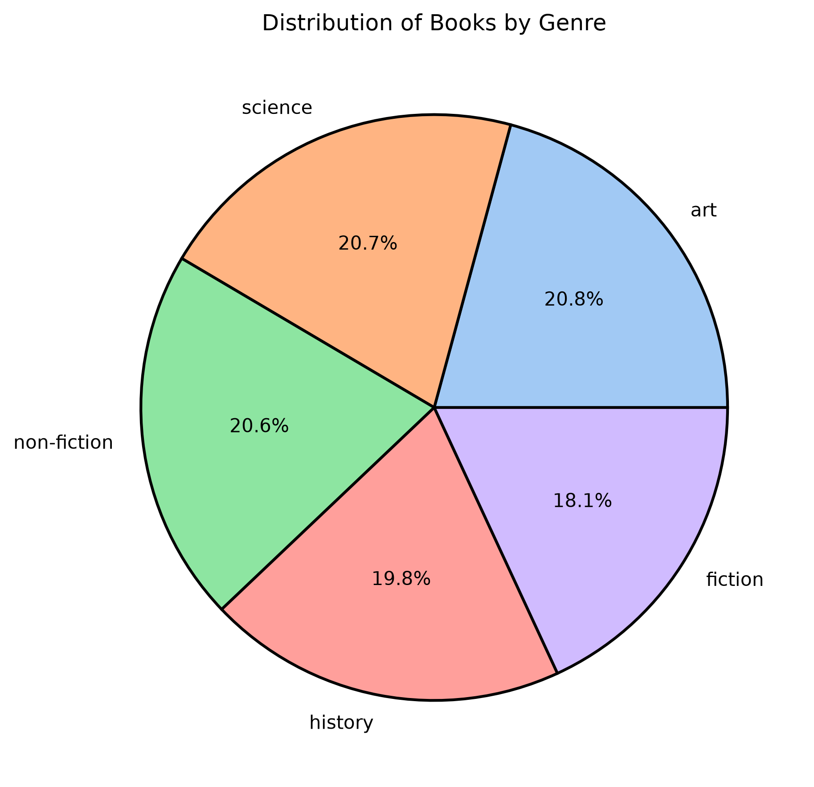
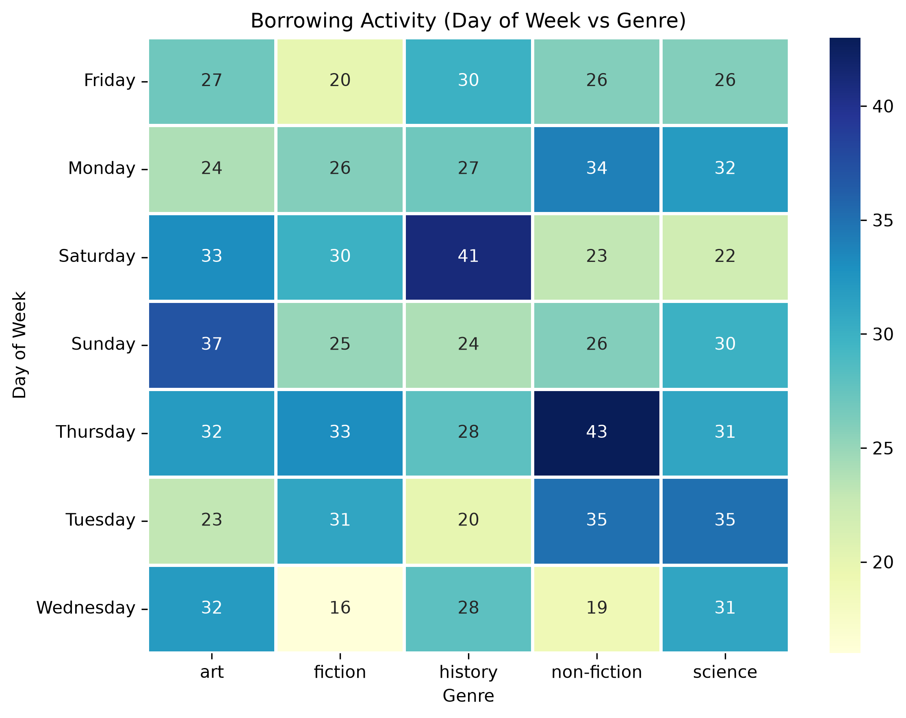

# 📚 E-Library Dashboard

A beginner-friendly **Python E-Library Dashboard** that loads library transaction data from CSV, cleans and transforms it, calculates key statistics, filters transactions by book category, and generates visualizations.

## 📌 Project Overview

This project uses **Pandas, NumPy, Matplotlib, and Seaborn** to analyze library borrowing transactions.

The dashboard performs the following tasks:

- Loads the original `library_transactions.csv` file
- Checks and removes missing records
- Calculates borrowing duration in days
- Extracts month and day-of-week information
- Generates a library summary report
- Calculates statistical measures
- Filters transactions by book category
- Creates four visualizations:
  - Bar chart
  - Monthly line graph
  - Genre distribution pie chart
  - Day-of-week vs genre heatmap

The implementation is organized around a `LibraryDashboard` class. fileciteturn0file0L6-L16

---

## 🛠️ Technologies Used

| Technology | Purpose |
|---|---|
| Python | Main programming language |
| Pandas | Data loading, cleaning, transformation and analysis |
| NumPy | Statistical calculations |
| Matplotlib | Graph generation |
| Seaborn | Enhanced visualizations |
| CSV | Source transaction dataset |

The project imports Pandas, NumPy, Matplotlib and Seaborn at the beginning of the program. fileciteturn0file0L1-L4

---

## 📂 Project Structure

```text
E-Library-Dashboard/
│
├── E-Library dashboard project.py
├── library_transactions.csv
├── README.md
│
└──screenshots/Console_output.png
└── Charts/
    ├── top_books_chart.png
    ├── monthly_trends_chart.png
    ├── genre_distribution_chart.png
    └── activity_heatmap.png
```

---

## 🔄 Data Processing

The dashboard reads the CSV using Pandas and checks whether missing values are present. If missing values are found, empty rows are removed. fileciteturn0file0L16-L29

It then transforms the transaction data by calculating:

**Borrowing Duration = Return Date − Borrow Date**

It also creates `Month` and `DayOfWeek` fields for further analysis. fileciteturn0file0L30-L40

---

## 📊 Dataset Summary

The supplied dataset contains:

- **1,000 transactions**
- **1,000 unique books**
- **1,000 unique users**
- Most borrowed book ID: **B1**
- Average borrowing duration: **10.22 days**
- Standard deviation of borrowing duration: **5.75 days**

The program's summary and statistical functions calculate transaction count, unique books/users, most-borrowed book, average duration, and standard deviation. fileciteturn0file0L48-L77

---

## 📸 Screenshots & Visual Gallery

### 🖥️ Terminal Output & Summary Report
*Displays successful data loading, cleaning status, summary metrics, and computed statistics inside VS Code.*



---

# 📈 Visualizations

## 1. Borrowing Count by Book Category

The bar chart compares the number of borrowing transactions across book categories.

| Category | Borrowings |
|---|---:|
| Art | 208 |
| Science | 207 |
| Non-fiction | 206 |
| History | 198 |
| Fiction | 181 |



The source code creates this category-level bar chart using `book_category` value counts. fileciteturn0file0L88-L105

---

## 2. Monthly Borrowing Trends

This line graph shows how borrowing activity changes across the months.

| Month | Borrowings |
|---|---:|
| Jan | 101 |
| Feb | 65 |
| Mar | 99 |
| Apr | 74 |
| May | 78 |
| Jun | 86 |
| Jul | 91 |
| Aug | 80 |
| Sep | 79 |
| Oct | 82 |
| Nov | 94 |
| Dec | 71 |



The dashboard groups transactions by numerical month and plots the monthly borrowing trend. fileciteturn0file0L108-L123

---

## 3. Distribution of Books by Genre

The pie chart represents the proportion of borrowing transactions belonging to each book category.



The program generates the genre distribution using `book_category.value_counts()` and displays the proportions as a pie chart. fileciteturn0file0L125-L132

---

## 4. Borrowing Activity Heatmap

The heatmap analyzes borrowing activity by **day of the week** and **book genre**.



The dashboard creates a pivot table using `DayOfWeek` as the index, `book_category` as the columns, and transaction counts as the values. fileciteturn0file0L134-L144

---

# 🧮 Statistical Analysis

The project uses NumPy to calculate:

```text
Average Borrowing Duration
Standard Deviation of Borrowing Duration
```

The most frequently borrowed book is identified using Pandas `mode()`. fileciteturn0file0L61-L77

### Results

```text
Most Borrowed Book ID       : B1
Average Borrowing Duration  : 10.22 days
Standard Deviation          : 5.75 days
```

---

# 🔎 Filtering Feature

The dashboard includes a category filtering function.

Example:

```python
dashboard.filter_transactions("non-fiction")
```

The function compares the requested category with `book_category` and returns matching transaction records. fileciteturn0file0L79-L86

---

# ▶️ How to Run

### 1. Install the required libraries

```bash
pip install pandas numpy matplotlib seaborn
```

### 2. Keep both files in the same folder

```text
E-Library dashboard project.py
library_transactions.csv
```

### 3. Run the Python program

```bash
python "E-Library dashboard project.py"
```

The program loads the CSV, generates the summary and statistics, applies the example category filter, and creates the charts. fileciteturn0file0L147-L163

---

# 📁 Generated Chart Files

Running the visualization function produces:

```text
top_books_chart.png
monthly_trends_chart.png
genre_distribution_chart.png
activity_heatmap.png
```

The source code saves each visualization as a PNG file at 300 DPI. fileciteturn0file0L95-L105 fileciteturn0file0L108-L123 fileciteturn0file0L125-L132 fileciteturn0file0L134-L144

---


# 💡 Key Insights

Based on the supplied transaction data:

1. **Art** has the highest number of borrowing transactions with **208**.
2. **Fiction** has the lowest number with **181**.
3. **January** has the highest monthly borrowing activity with **101** transactions.
4. **February** has the lowest monthly activity with **65** transactions.
5. The average borrowing duration is approximately **10.22 days**.
6. The borrowing-duration standard deviation is approximately **5.75 days**.

---

## 👩‍💻 Author

**E-Library Dashboard Project**

Built as a beginner-friendly Python data analysis and visualization project.
